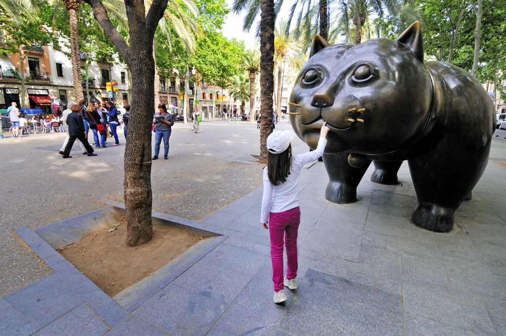
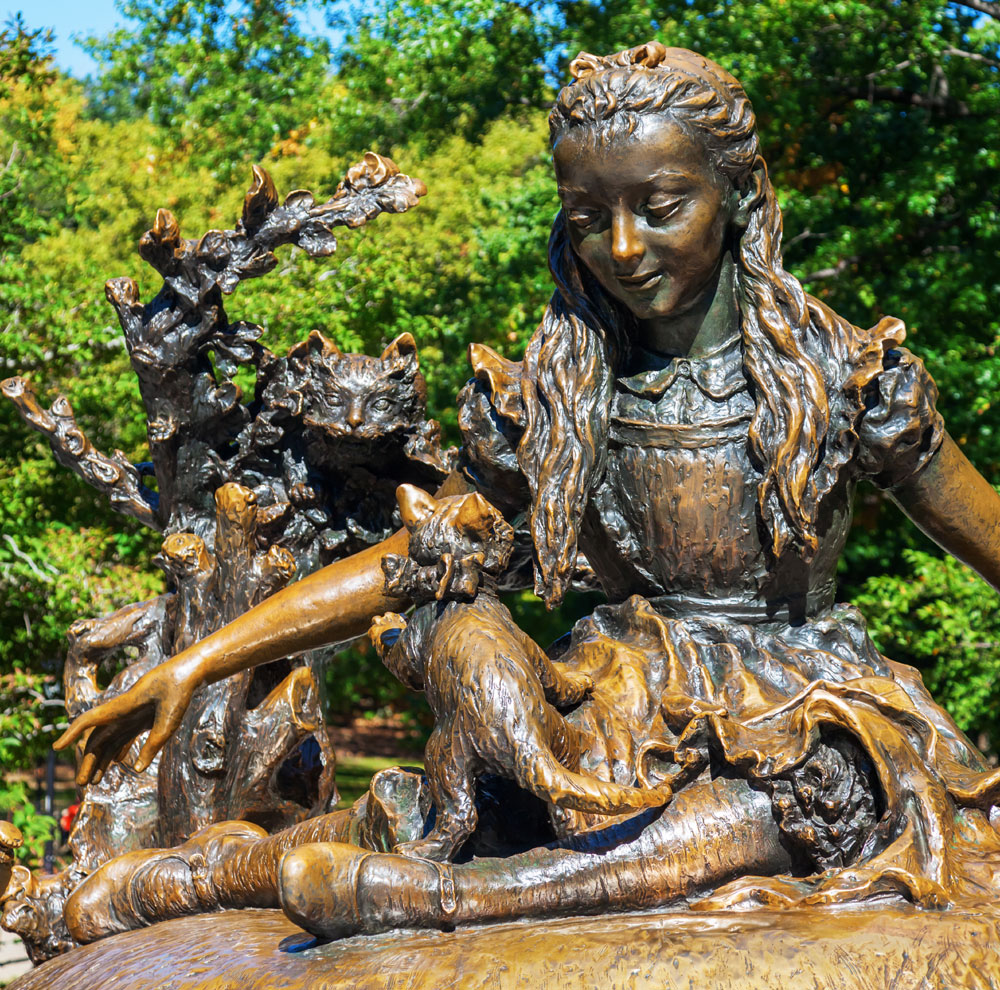
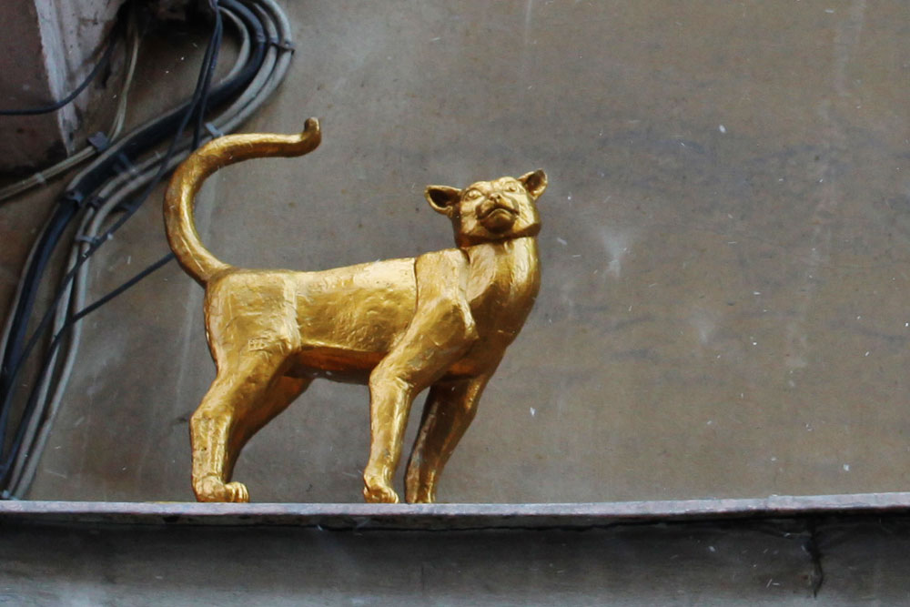
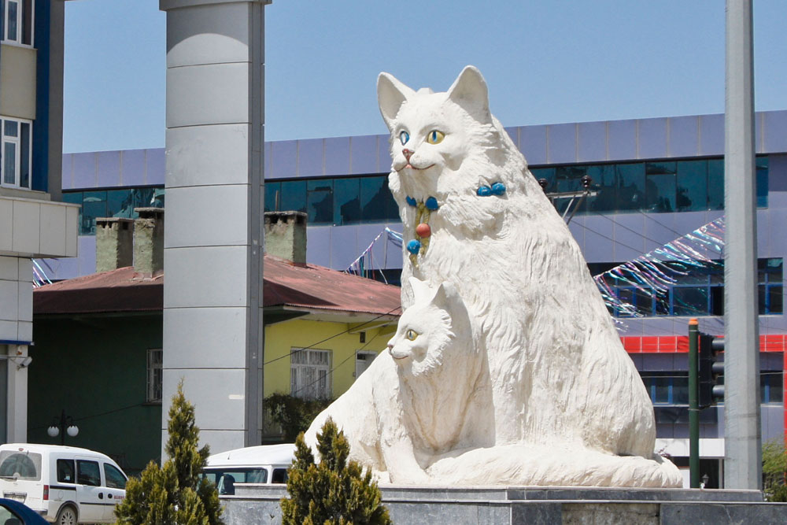
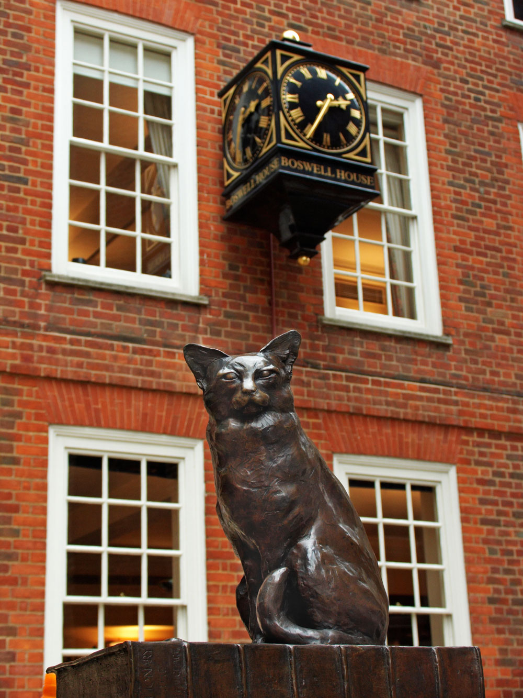
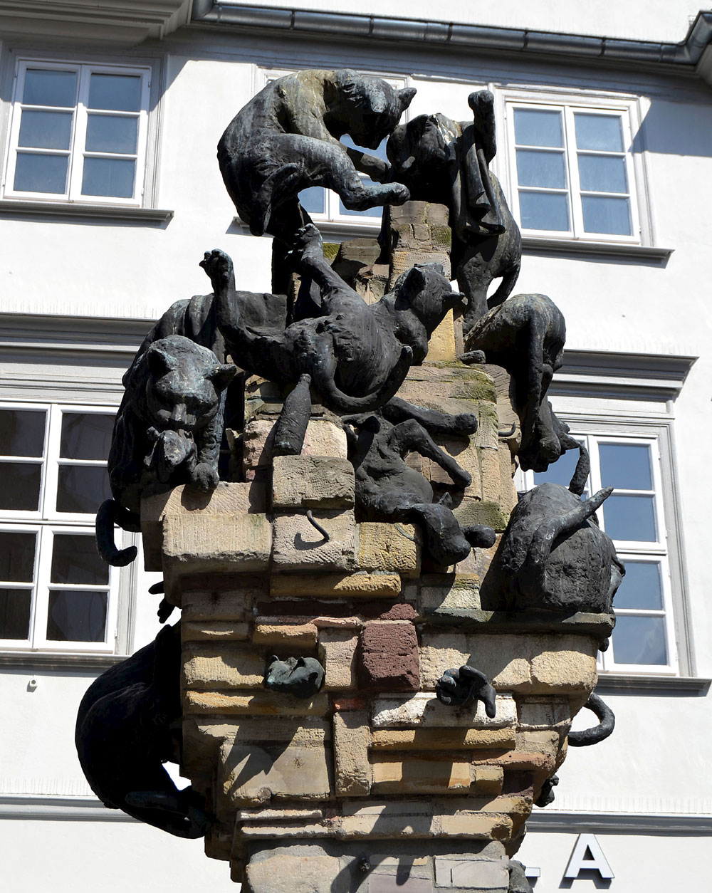
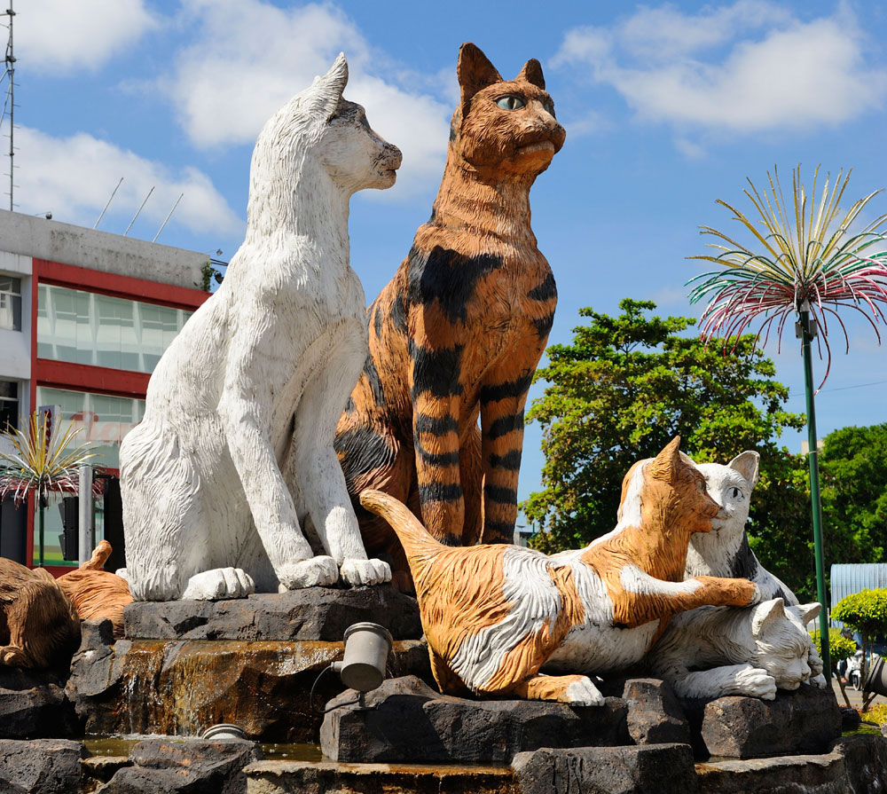
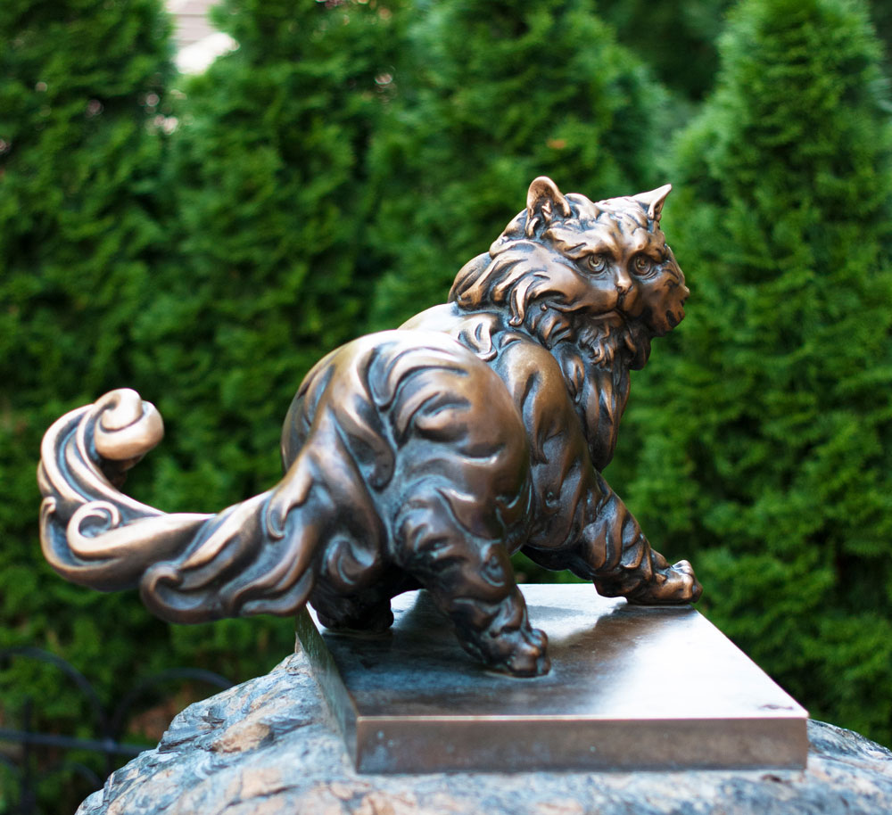

# STREET KINGS: 9 MONUMENTS TO CATS

Where does Yoshkin the cat live? In Yoshkar-Ola. And Klaipeda - in Klaipeda. To place a monument to a cat means to automatically create a popular place in the city.

## Raval Cat
Spain, Barcelona

The two-ton bronze cat, "fattened" like other heroes of Colombian sculptor Fernando Botero, for 15 years "wandered" through the streets of Barcelona in search of a decent place. In 2003, a big man with a boy's face and pronounced attributes of masculinity found a house in the Rambla del Raval, and this area was loved by artists, musicians and tourists. The last ones to rub the animal's nose for good luck, but knowledgeable people say that rubbing should be done differently.

## Cheshire cat
USA, New York

The sculptural group of "Alice" heroes in the Central Park is installed especially for children: you can climb mushrooms and squeeze cats. There are two of them: on a tree - Cheshire Cat, and on Alice's lap - her favorite Dina.

## Vasilisa
Russia, St. Petersburg

According to popular belief among St. Petersburgers, this is a monument to the animals who saved the besieged Leningrad from the invasion of rats. Vasilis's cat walks along the ledge of the house on Malaya Sadovaya, and in the corner of the house opposite the cat Elisey sits.

## Van cats
Turkey, Van

Special Turkish breed representatives are often distinguished by white color and eyes of different colors. Residents of the city of Van - the birthplace of the beauties - are so proud of their cats that made them a symbol of the city. At the entrance to Van, guests are greeted by a five-meter cat sculpture with a kitten.

## Hodge
Great Britain, London

Samuel Johnson, a scientist, poet, and Enlightenment critic, who compiled an English explanatory dictionary in 1755, had a cat called Hodge. The fame of the master extended to the cat - poets dedicated poems to him. The sculpture opposite the Johnson House Museum depicts Hodge sitting on the dictionary. In front of the cat - oyster shells: Johnson fed Hodge oysters. The owner's words are engraved on the monument: "Truly a wonderful cat.

## Cat rapture
Germany, Braunschweig

The column with playing and fighting cats is the most extraordinary monument in the city. Passersby perceive it as a symbol of peaceful attitude towards stray cats. But the work of the sculptor Siegfried Neuenhausen is not so simple. Many of them are dedicated to social and political problems. This one hints at human behavior. The name of the sculpture - Katzenbalgen - can be translated as "Cat chatter".

## Family of cats
Malaysia, Kalimantan, Kuching

The name of the city, according to one of the versions, is translated as "cat". And there are a lot of sculptures of cats. The most multi-figured and photographed composition is in the tourist area on the busy square: it is Mom, Dad and seven kittens. Tourists are happy.

## House with cats
Latvia, Riga

A certain merchant put on the towers of his profitable house black cats tails to the windows of the Great Guild, allegedly in retaliation for the fact that the merchant in the guild was not accepted. Later, the cats were deployed, and today they are one of the symbols of Riga.

## Cat Panteleimon
Ukraine, Kiev

The monument near the restaurant Pantagruel is placed to a real Persian cat Panteleimon, who died in a fire at the facility in the late 1990s. According to the legend, the cat warned people about danger.
